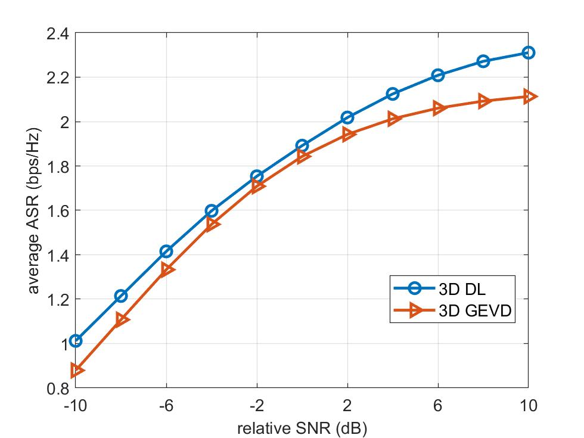

# UAV_3Dbeamforming
This repository contains main codes for simulation of the paper "Deep Learning Driven 3D Robust Beamforming for Secure Communication of UAV Systems", which has been submitted to IEEE Wireless Communications Letters for possible publication.

Requirements:
=
Python == 3.7.0, Tensorflow-gpu == 1.14.0

File Discription:
=
**csi_gen.m**: to generate the training data sets  
**Ray_channel.m**: complement for csi_gen.m  
**Folder named data**: to store the training data sets  
**Folder named c_e**: to store the errored location of Eve  
**Folder named output**: to store the trained network parameters and R_s  
**opt_tf.py**: main .py file  
**fun_1_tf.py**: complement to opt_tf.py  
**para_cor.txt**：parameters and data sets corresponding illustration  
**f_G.py**: to generate the corresponding beamforming vector  
**fig3.m**: to plot Fig. 3 in the paper (2D scenario is similar, which is omitted)  
**fig5.m**: to plot Fig. 5 in the paper
**opt_multiEve.py and multiEve_comp.m**: for multiple Eves scenario  

How to Run This:
=
___You need to create directories to store files before running.___
**Step1**: run csi_gen.m, and data should be generated and placed into .\data\1~3  
**Step2**: run opt_tf.py, you can switch data sets by changing X in path, e.g., './data/X/'，'./output/network_DSN/X/'  
**Step3**: run f_G.py  
**Step4**: run fig3.m  
**Step5**: run fig5.m
**Step5**: run opt_multiEve.py and multiEve_comp.m (for multiple Eves scenario)  

Typical results:
=
___Fig3___:

___Fig5___:

___multiEve_comp___:

